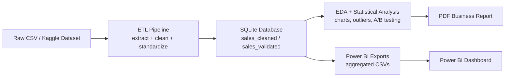
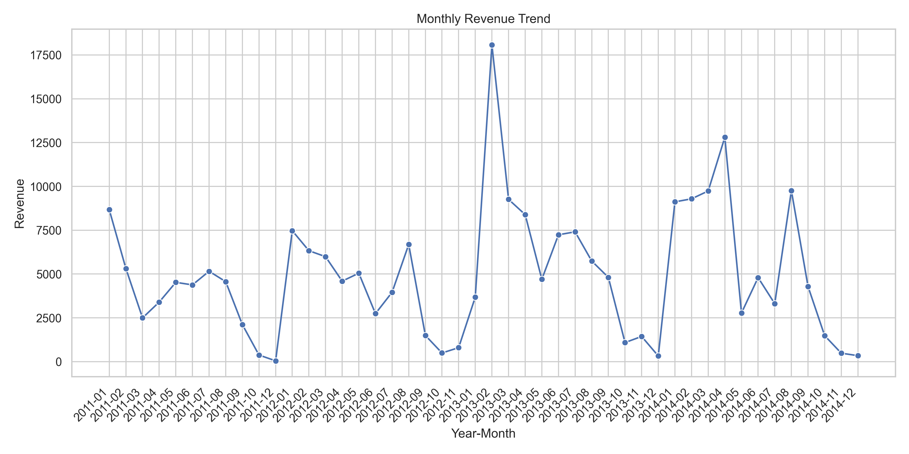
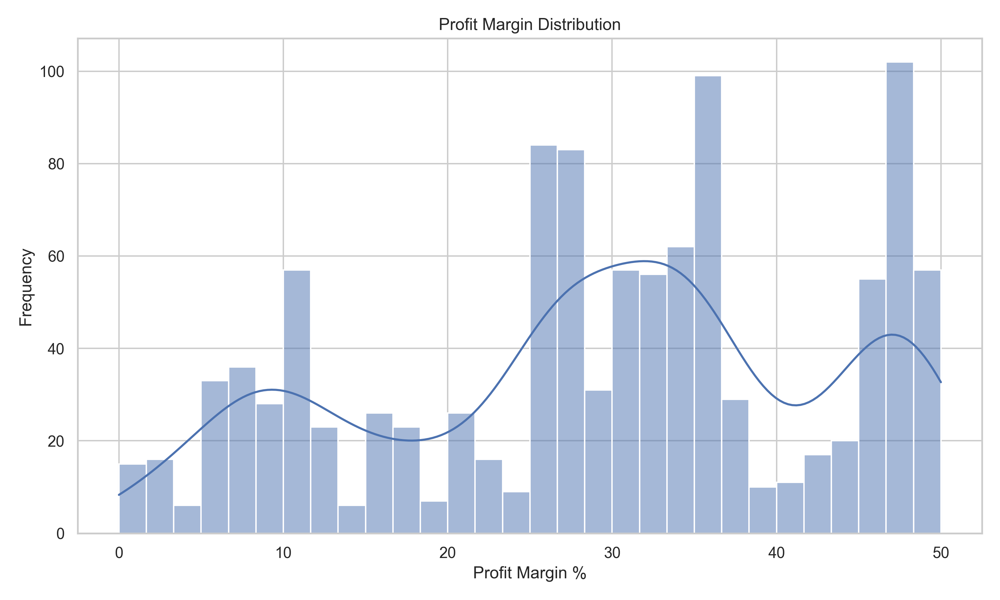
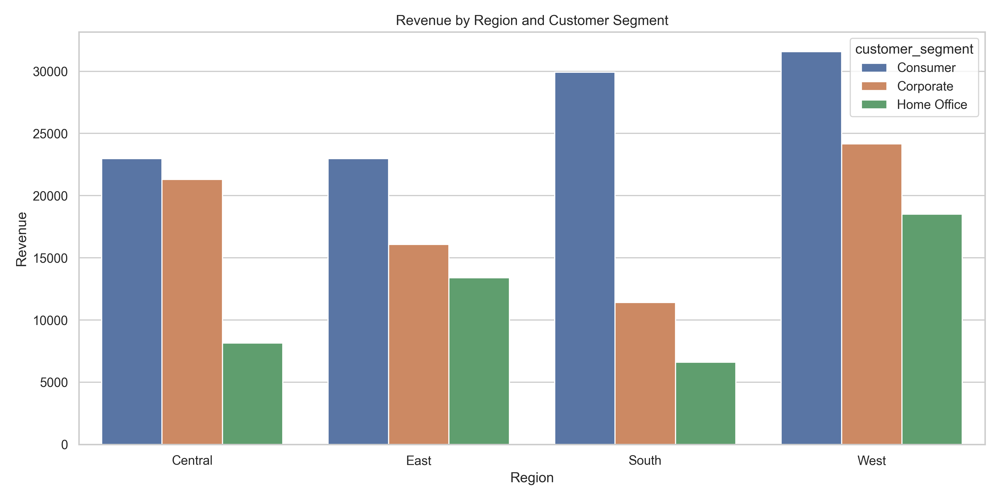

# End-to-End Sales BI Pipeline

A portfolio-ready data analytics project that turns raw retail transactions into validated datasets, analytical outputs, and BI-ready reporting. The workflow covers ETL, data validation, exploratory analysis, statistical testing, automated exports, and executive-style reporting using Python, SQL, SQLite, and Power BI-ready assets.


## Why This Project Stands Out

- Built an end-to-end analytics workflow instead of a single notebook, covering ingestion through business reporting.
- Structured the project around practical analyst responsibilities: ETL, Data Validation, EDA, KPI analysis, A/B Testing, and stakeholder-ready outputs.
- Produced reusable deliverables for both technical and business audiences, including SQLite tables, CSV exports, visualizations, and a PDF summary report.

## Architecture



## Project Workflow

1. Download a compatible Superstore-style dataset from Kaggle.
2. Clean and standardize the raw sales data with a Python ETL pipeline.
3. Validate records and persist a production-ready `sales_validated` table in SQLite.
4. Analyze revenue, margin, segment behavior, and outliers with EDA and KPI queries.
5. Export Power BI-ready CSVs and generate a one-page PDF business summary.

## Repository Contents

```text
.
├── download_superstore_sales.py
├── etl_sales_pipeline.py
├── validate_sales_data.py
├── sales_kpi_queries.py
├── sales_eda.py
├── ab_test_sales.py
├── export_powerbi_csvs.py
├── generate_sales_report.py
├── sales_pipeline.db
├── outputs/
└── exports/
```

## Tech Stack

- Python for ETL, analysis, automation, and reporting
- Pandas and NumPy for data wrangling and transformation
- SQLite and SQL for local storage and KPI querying
- Matplotlib and Seaborn for visual analytics
- SciPy for Statistical Analysis and A/B Testing
- Power BI-ready CSV exports for dashboard development
- ReportLab for automated PDF reporting

## Setup

### 1. Clone the repository

```bash
git clone https://github.com/your-username/end-to-end-sales-bi-pipeline.git
cd end-to-end-sales-bi-pipeline
```

### 2. Create and activate a virtual environment

```bash
python3 -m venv .venv
source .venv/bin/activate
```

### 3. Install dependencies

```bash
pip install pandas numpy scipy matplotlib seaborn reportlab kaggle python-dotenv
```

### 4. Configure Kaggle credentials

Use either of these approaches:

- Set `KAGGLE_USERNAME` and `KAGGLE_KEY` in your shell or `.env`
- Or place `kaggle.json` at `~/.kaggle/kaggle.json`

Example `.env`:

```bash
KAGGLE_USERNAME=your_kaggle_username
KAGGLE_KEY=your_kaggle_api_key
```

## Run The Pipeline

### 1. Download a compatible dataset

```bash
python3 download_superstore_sales.py
```

### 2. Run ETL and create `sales_cleaned`

```bash
python3 etl_sales_pipeline.py data/superstore_sales.csv
```

### 3. Validate records and create `sales_validated`

```bash
python3 validate_sales_data.py
```

### 4. Generate exploratory analysis charts

```bash
python3 sales_eda.py
```

### 5. Run segment A/B testing

```bash
python3 ab_test_sales.py
```

### 6. Export Power BI-ready CSV files

```bash
python3 export_powerbi_csvs.py
```

### 7. Generate a 1-page PDF business report

```bash
python3 generate_sales_report.py
```

### 8. Query KPIs programmatically

```python
from sales_kpi_queries import get_revenue_profit_margin_by_region

kpi_df = get_revenue_profit_margin_by_region()
print(kpi_df.head())
```

## Business Questions Answered

- Which regions drive the highest revenue and profit?
- How does revenue trend month over month?
- How do customer segments compare on sales performance?
- What is the margin impact of heavier discounts?
- Are average sales significantly different between Consumer and Corporate segments?

## Key Findings

- Identified the highest-revenue region as the strongest contributor to overall sales performance, highlighting a clear opportunity for region-focused growth strategies.
- Found that orders with heavier discounts were associated with lower profitability, reinforcing the need for tighter discount governance.
- Performed Statistical Analysis and A/B Testing on `Consumer` vs `Corporate` segments and found no significant difference in average sales (`p = 0.486`), indicating that customer segment alone did not drive material sales variation.

## Deliverables

This project produces recruiter-friendly and stakeholder-ready outputs:

- Validated SQLite tables: `sales_cleaned`, `sales_validated`
- Exploratory charts saved in `outputs/`
- Power BI-ready aggregated CSVs saved in `exports/`
- Segment A/B testing visualization in `ab_test_result.png`
- A 1-page PDF executive summary in `outputs/`

## Screenshots

### Monthly Revenue Trend



### Profit Margin Distribution



### Revenue by Region and Customer Segment



## Author

**Abhyudaya Lohani**

- LinkedIn: [https://www.linkedin.com/in/abhyudaya-lohani/](https://www.linkedin.com/in/abhyudaya-lohani/)
- GitHub: [https://github.com/Abhyudaya01](https://github.com/Abhyudaya01)
